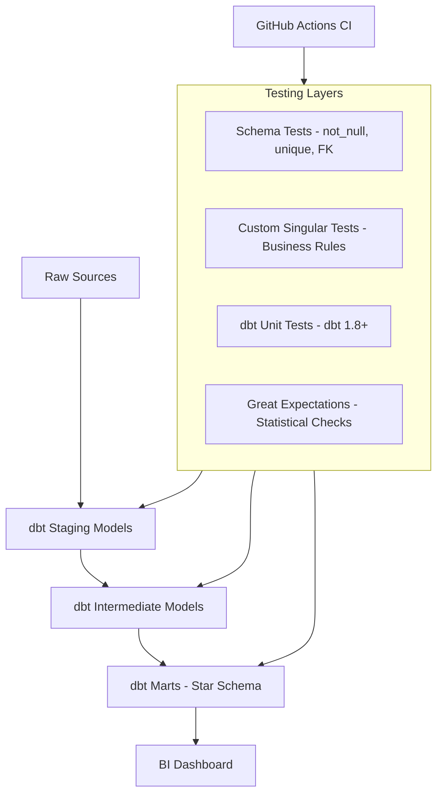

# dbt Full Testing Suite — Production Data Quality


A reference dbt project demonstrating enterprise-grade data testing: schema tests, custom singular tests, dbt unit tests (dbt 1.8+), data contracts, Great Expectations integration, and GitHub Actions CI/CD.

## Architecture



## Test Coverage

| Test Type | Count | Scope |
|-----------|-------|-------|
| Schema tests (built-in) | 45+ | All models |
| Custom singular tests | 12 | Business logic |
| dbt unit tests | 8 | Complex macros |
| Great Expectations suites | 5 | Critical datasets |

## Quick Start

```bash
git clone https://github.com/zulham-tech/dbt-full-testing-suite.git
cd dbt-full-testing-suite
pip install dbt-bigquery dbt-utils
dbt deps
dbt build          # run models + all tests
dbt docs generate && dbt docs serve
```

## Project Structure

```
.
├── models/
│   ├── staging/         # Source cleaning and type casting
│   ├── intermediate/    # Business logic layer
│   └── marts/           # Star schema (dim_ + fct_ tables)
├── tests/
│   ├── singular/        # Custom SQL data tests
│   └── unit/            # dbt unit tests (v1.8+)
├── macros/              # Reusable SQL macros
├── analyses/            # Ad-hoc analytical queries
├── dbt_project.yml
└── packages.yml
```

## Author

**Ahmad Zulham Hamdan** — [LinkedIn](https://linkedin.com/in/ahmad-zulham-665170279) | [GitHub](https://github.com/zulham-tech)
